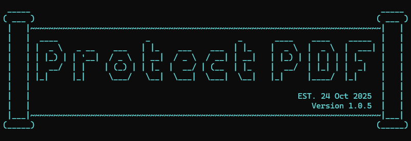

# PDF Password Protection Tool
<h1 align="center">
    
  <br>
</h1>

<h4 align="center">Lightweight Windows utility for securing PDF documents with AES-256 encryption</h4>

<p align="center">

<a href="https://opensource.org/licenses/MIT"></a>
<a href="https://github.com/frustrat3d-aud1t0r/Protect-PDF/issues"></a>
<a href="https://github.com/frustrat3d-aud1t0r/Protect-PDF/releases"></a>

</p>

<p align="center">
  <a href="#-quick-start---zero-configuration-required">Quick Start</a> •
  <a href="#-features">Features</a> •
  <a href="#-running-the-tool">Usage</a> •
  <a href="#for-security-teams">For Security Teams</a> •
  <a href="#-troubleshooting">Troubleshooting</a>
</p>

---

PDF Password Protection Tool is a specialized Windows utility designed to automate PDF encryption with military-grade AES-256 security. It focuses on providing dual-password protection, granular permission controls, and compliance-ready data retention tracking through an intuitive drag-and-drop interface and automated dependency management.

# 🔧 Features

<h1 align="left">
  
</h1>

- 🔒 **Military-Grade Encryption** - AES-256-CBC cryptographic protection for maximum document security
- ⭐ **Dual Password Protection** - Separate user (view) and owner (full access) password capabilities
- 🛡️ **Granular Permissions** - Fine-grained control over printing, copying, editing, and annotation rights
- 📅 **Compliance Tracking** - 30-day retention monitoring for data protection regulations
- ⚡ **Drag-and-Drop Interface** - Zero-command-line workflow for rapid encryption
- 🎯 **Smart File Naming** - Automated timestamped output (YYYYMMDD) with collision prevention
- 🛠️ **Zero Configuration** - Automatic dependency installation on first run

## Permission Matrix

| Permission Level | Capabilities | Use Case |
|------------------|--------------|----------|
| **User Password** | View, Print (High-Quality) | Document distribution to clients/partners |
| **Owner Password** | Full Access (Copy, Modify, Annotate, Fill Forms) | Internal document management and editing |
| **No Password** | Restricted Access (Cannot open) | Maximum security for sensitive files |

# 📦 Quick Start - Zero Configuration Required!

**Just run Protect-PDF.bat - that's it!**

The tool automatically handles all dependencies and requirements on first run.

```bash
# First time? No problem!
> Double-click Protect-PDF.bat (or drag a PDF onto it)
> Tool automatically detects and installs all required dependencies
> Enter your password and start encrypting immediately!

# All subsequent runs - instant encryption
> No installation messages
> No waiting
> Just password and encrypt!
```

> 🎯 **The tool automatically installs Python and PyMuPDF if not already present. Zero manual setup required!**

## For Security Teams

For security teams and compliance professionals, PDF Password Protection Tool provides enterprise-grade capabilities:

- ✅ **HIPAA/PCI DSS Compliance** - Meets encryption requirements for healthcare and financial data
- ✅ **Audit Trail Generation** - Timestamped file naming for version control and forensics
- ✅ **Password Policy Enforcement** - Minimum strength requirements (8+ chars for user, 12+ for owner)
- ✅ **Data Retention Tracking** - Built-in 30-day expiration monitoring for regulatory compliance
- ✅ **No Data Leakage** - Original files remain unmodified; encrypted copies stored separately
- ✅ **Cryptographic Standards** - PBKDF2 key derivation and PDF Security Handler Revision 6
- ✅ **Batch Workflow Support** - Sequential processing for large-scale document protection
- ✅ **Permission Segregation** - Role-based access control through dual-password architecture

## 🚀 Running the Tool

### Method 1: Drag & Drop (Recommended)

```bash
# Simply drag your PDF file onto Protect-PDF.bat
# Enter password when prompted
# Encrypted file appears in OUTPUT/ folder
```

### Method 2: Double-Click

```bash
# Double-click Protect-PDF.bat
# Provide file path: C:\Documents\sensitive.pdf
# Set password: ********
# Output: OUTPUT/sensitive_20251026.pdf
```

### Advanced: Same Password for User and Owner

```bash
# When prompted for owner password, press Enter to use same password
# This grants full access with a single password
```

### Advanced: Different Passwords for Role Separation

```bash
# Set user password: ViewOnly123!
# Set owner password: FullAccess456!@
# Distribute user password to viewers, keep owner password for editors
```

## 📊 Encryption Specifications

| Component | Implementation | Standard |
|-----------|----------------|----------|
| **Algorithm** | AES-256-CBC | FIPS 197 |
| **Key Derivation** | PBKDF2 | PKCS #5 v2.0 |
| **Permission Encoding** | PDF Security Handler Revision 6 | ISO 32000-2 |
| **Metadata Protection** | Encrypted | PDF 2.0 Standard |

## 🛡️ Security Architecture

### Password Policy

**User Password (Minimum Requirements):**
- ✅ 8+ characters
- ✅ Mixed case letters (uppercase + lowercase)
- ✅ Numeric digits
- ✅ Special characters recommended

**Owner Password (Enhanced Requirements):**
- ✅ 12+ characters minimum
- ✅ Must differ from user password
- ✅ Grants unrestricted document access

> ⚠️ **Security Notice:** Passwords are displayed during input. Ensure no visual surveillance when entering credentials.

### Data Handling

- **Original Files:** Remain unmodified in source location
- **Output Location:** `OUTPUT/` directory (automatically created)
- **Naming Convention:** `{original_name}_{YYYYMMDD}.pdf`
- **Collision Handling:** Sequential numbering (`_1`, `_2`, etc.) for same-day duplicates

## 📁 Project Structure

```
pdf-password/
│
├── Protect-PDF.bat                # Main executable (Windows)
├── README.md                      # Documentation
├── README.html                    # Styled documentation
│
├── scripts/
│   ├── protect_pdf.py             # Encryption engine (PyMuPDF-based)
│   └── Protect-PDF-Simple.ps1     # PowerShell wrapper
│
└── OUTPUT/                        # Encrypted PDFs (auto-created)
```

## 🔍 Troubleshooting

<details>
<summary><b>❌ Error: "Python is not installed or not in PATH"</b></summary>

<br>

**Solution:**
```powershell
# Verify Python installation
python --version

# If not found, reinstall with PATH option checked
winget install Python.Python.3.12

# Alternative: Add Python to PATH manually
# Settings > System > About > Advanced system settings > Environment Variables
```
</details>

<details>
<summary><b>❌ Error: "PyMuPDF installation failed"</b></summary>

<br>

**Solution:**
```powershell
# Manual installation
pip install --upgrade pip
pip install PyMuPDF

# Alternative: Use conda
conda install -c conda-forge pymupdf

# Verify installation
python -c "import fitz; print(fitz.__doc__)"
```
</details>

<details>
<summary><b>❌ Script won't run - "execution policy" error</b></summary>

<br>

**Solution:**
```powershell
# Open PowerShell as Administrator
Set-ExecutionPolicy -ExecutionPolicy RemoteSigned -Scope CurrentUser

# Verify change
Get-ExecutionPolicy

# Should return: RemoteSigned
```
</details>

<details>
<summary><b>❌ PDF output is corrupted or won't open</b></summary>

<br>

**Solution:**
- Ensure input PDF is not already encrypted/password-protected
- Verify sufficient disk space in OUTPUT directory
- Check PyMuPDF version compatibility: `pip show PyMuPDF`
- Try with a different PDF to isolate file-specific issues
- Ensure PDF is not open in another application during encryption
</details>

<details>
<summary><b>❌ Password not accepted when opening encrypted PDF</b></summary>

<br>

**Solution:**
- Verify no extra spaces before/after password
- Check CAPS LOCK status (passwords are case-sensitive)
- Remember: User password for viewing, Owner password for full access
- If same password was used for both, either password will work
</details>

## 📝 Changelog

### Version 1.0.5 (2025-10-25)

- 🔇 **Cleaner Output** - Suppressed library check messages when dependencies already installed
- ✨ **Better UX** - Only displays messages when user action required
- 🎨 **Visual Enhancement** - ASCII banner display at startup
- ⚡ **Optimized** - Removed redundant success messages

### Version 1.0.4 (2025-10-24)

- ✨ Owner password grants full access (copy, modify, annotate, fill forms)
- 🖨️ High-quality printing permission for all password types
- 🔒 Owner password: 12+ character minimum, must differ from user password
- ⚡ Removed password confirmation for faster workflow
- 🎨 Fixed terminal box alignment issues
- 📂 Organized structure: scripts in subfolder, outputs in OUTPUT directory
- 🪟 Custom terminal window title for easy identification
- 🎯 Changed timestamp format from HHMM to YYYYMMDD

## 🤝 Contributing

We welcome contributions from the security and compliance community! Here's how you can help:

<table>
<tr>
<td align="center">🐛<br><b>Report Bugs</b><br>Open an issue with detailed reproduction steps</td>
<td align="center">💡<br><b>Suggest Features</b><br>Share ideas for encryption workflows</td>
<td align="center">📖<br><b>Improve Docs</b><br>Help clarify usage and security guidance</td>
<td align="center">🔧<br><b>Submit PRs</b><br>Follow coding standards and test thoroughly</td>
</tr>
</table>

## 📄 License

**Authorized Use Only**

This tool is provided for legitimate security, compliance, and data protection purposes. Users are responsible for ensuring compliance with applicable laws and regulations regarding encryption and data privacy.

## 💬 Support

<table>
<tr>
<td>

**Need Help?**

For questions, issues, or feature requests:

- 🐛 **Issues:** [GitHub Issues](https://github.com/frustrat3d-aud1t0r/Protect-PDF/issues)
- 📖 **Documentation:** [Full Documentation](README.html)
- 💬 **Community:** Open a discussion for general questions

</td>
</tr>
</table>

## 🌟 Acknowledgments

Built with these powerful technologies:

<table>
<tr>
<td align="center">
<a href="https://pymupdf.readthedocs.io/">
<br>
<b>PyMuPDF</b>
</a><br>
High-performance PDF processing library
</td>
<td align="center">
<a href="https://www.python.org/">
<br>
<b>Python</b>
</a><br>
Cross-platform programming language
</td>
<td align="center">
<a href="https://docs.microsoft.com/powershell/">
<br>
<b>PowerShell</b>
</a><br>
Windows automation framework
</td>
</tr>
</table>

---

<p align="center">
  
  
  
</p>

<h3 align="center">🔐 Protect your sensitive documents with military-grade encryption</h3>

<p align="center">
  <b>Made with ❤️ for Windows</b>
</p>

<p align="center">
  ⭐ <b>Star this repo if you find it useful!</b> ⭐
</p>

---

<p align="center">
  <sub>© 2025 PDF Password Protection Tool | AES-256 Encryption Standard</sub>
</p>
